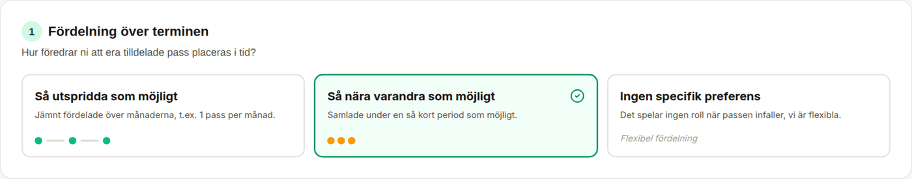
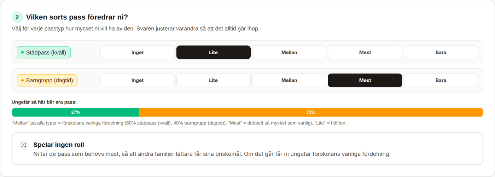
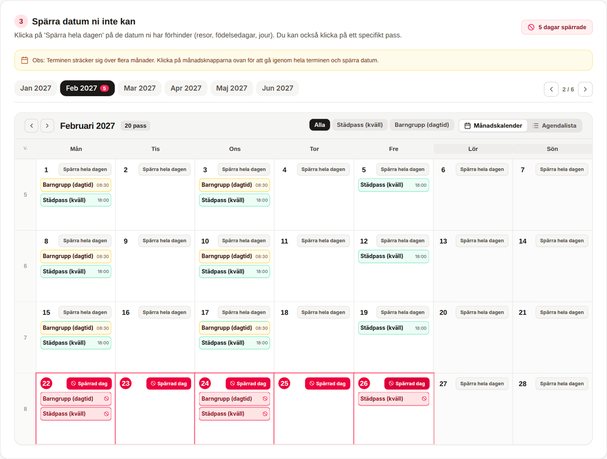
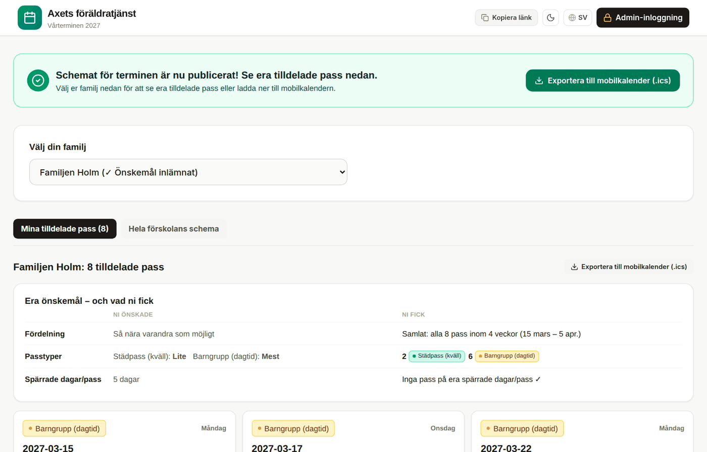
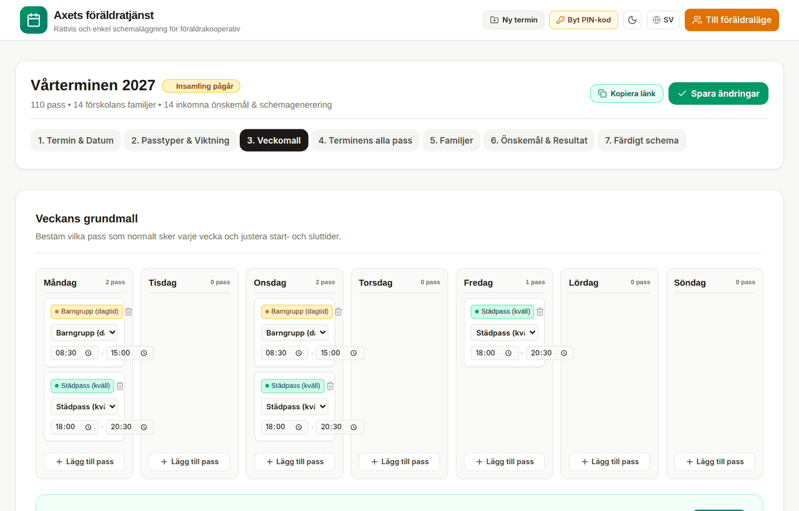
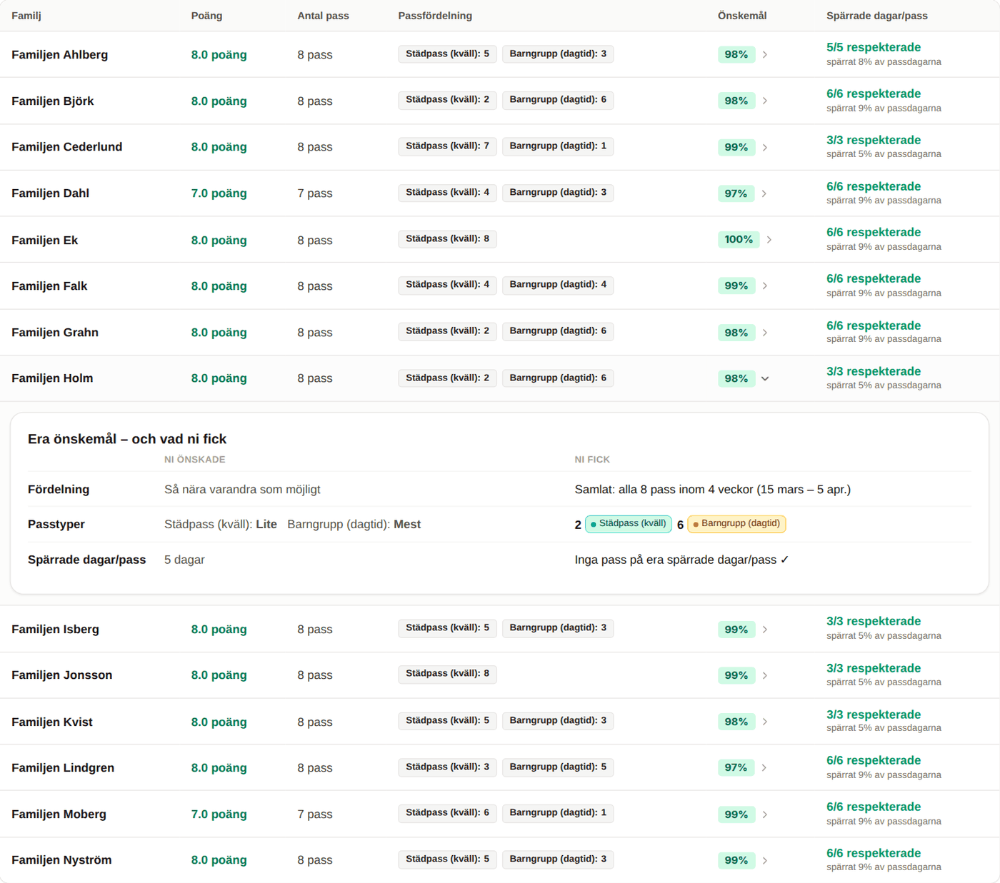
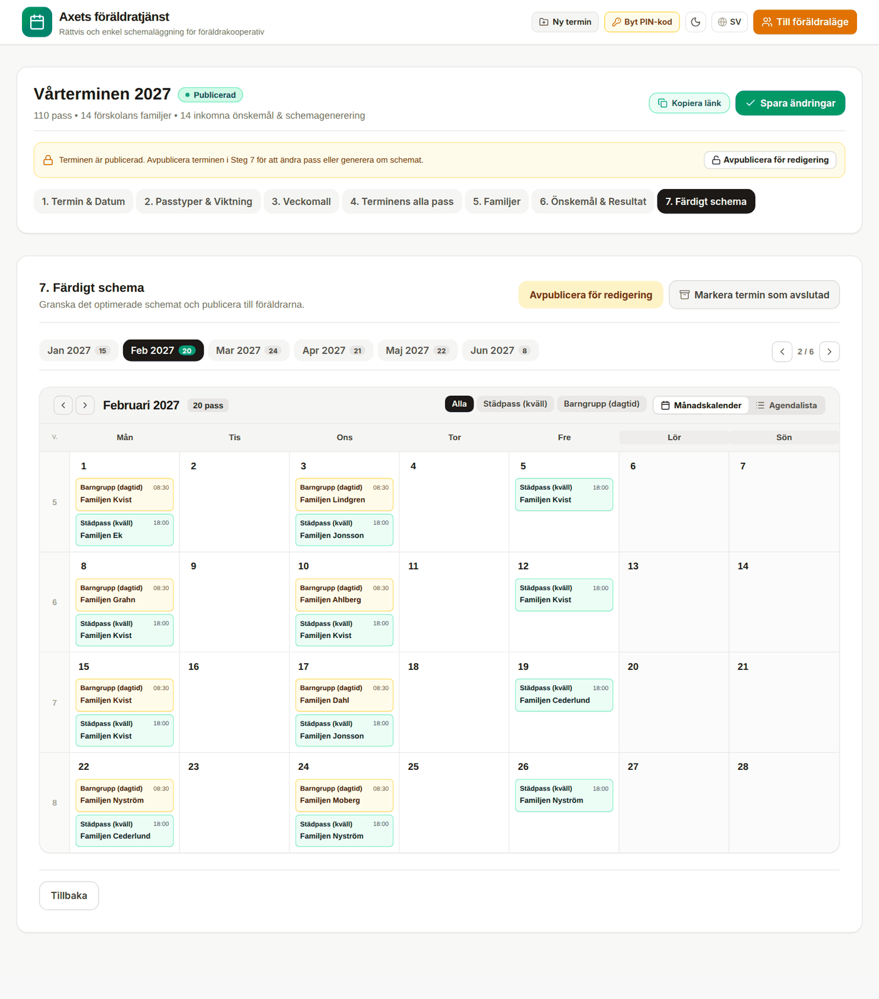

# Axets föräldratjänst

Ett litet verktyg för att planera föräldrakooperativets städpass, barngrupp och andra föräldrainsatser – rättvist och utan Excel-pussel.

**Appen:** <https://justushellman.github.io/AxetsForaldratjanst/>

Varje termin går till så här:

| | Vem | Vad | Tid |
|---|---|---|---|
| **1** | Admin | Lägger upp terminen: passtyper, veckomall och familjer. Delar länken. | ca 10 min |
| **2** | Familjerna | Svarar på tre frågor om sina önskemål. | ca 1 min |
| **3** | Admin | Genererar schemat, granskar och publicerar. | ca 5 min |

---

## För familjer

Öppna länken som admin skickat (ingen inloggning behövs) och välj er familj i listan. Svara sedan på tre frågor och tryck **Spara mina önskemål**. Ni kan gå tillbaka och ändra fram tills schemat publiceras.

### 1. Hur ska passen ligga över terminen?



- **Så utspridda som möjligt** – jämnt fördelade, så långt isär det går.
- **Så nära varandra som möjligt** – samlade under en så kort period som möjligt, så att ni "gör bort" era pass.
- **Ingen specifik preferens** – spelar ingen roll när passen ligger.

### 2. Vilken sorts pass föredrar ni?



Välj för varje passtyp **Inget, Lite, Mellan, Mest** eller **Bara**. "Mellan" på allt betyder förskolans vanliga fördelning, "Mest" ungefär dubbelt så mycket som vanligt och "Lite" ungefär hälften. Svaren justerar varandra så att det alltid går ihop, och stapeln visar ungefär vad ni kommer att få.

**Spelar ingen roll** är ett bra val om ni inte bryr er – då tar ni de pass som behövs mest, vilket gör det lättare för andra familjer att få sina önskemål. Om det går får ni ändå ungefär den vanliga fördelningen.

Har förskolan bara en passtyp hoppas frågan över automatiskt.

### 3. Vilka dagar kan ni inte?



Bläddra mellan månaderna och tryck **Spärra hela dagen** på dagar ni inte kan (resor, sportlov, jobb), eller klicka på ett enskilt pass för att bara spärra det. Spärra det ni verkligen inte kan – ju mer som är spärrat, desto svårare blir det för alla andra.

### När schemat är publicerat



Samma länk visar nu era pass, och en sammanfattning av vad ni önskade och vad ni fick. Med **Exportera till mobilkalender (.ics)** läggs alla pass in i telefonens kalender (svensk tid).

Behöver ni byta ett pass? Kom överens med en annan familj och säg till admin, som flyttar passet i schemat.

---

## För admin

Gå till appen och tryck **Admin-inloggning** (eller lägg till `#/admin` i adressen). Logga in med PIN-koden.

> Första gången är PIN-koden **1234** – byt den direkt via **Byt PIN-kod**.

### Lägga upp en termin

Tryck **Ny termin**, ge den namn och datum, och välj om passtyper, veckomall och familjer ska kopieras från förra terminen (det sparar mest tid). Gå sedan igenom stegen:

1. **Termin & Datum** – namn, start och slut.
2. **Passtyper & Viktning** – t.ex. "Städpass (kväll)" och "Barngrupp (dagtid)", med tider, färg och **poäng**. Ett tyngre pass kan vara värt mer, t.ex. 1,5 eller 2 poäng.
3. **Veckomall** – vilka pass som behövs en vanlig vecka. Tryck sedan **Generera terminens alla pass**.

   

4. **Terminens alla pass** – kalendern med alla pass. Ta bort pass på röda dagar eller lägg till extra pass.
5. **Familjer** – lägg till en i taget eller **Klistra in flera familjer** (en per rad).

Tryck sedan **Spara och dela länk med föräldrar** och skicka länken, t.ex. i föräldragruppen.

### Generera och publicera

6. **Önskemål & Resultat** – här ser du hur många som svarat. Gula rutan **Bra att veta innan du genererar** dyker upp om något inte går ihop, t.ex. en familj som spärrat nästan hela terminen eller fler samtidiga pass än det finns familjer. Tryck **Generera rättvist schema** (tar en sekund eller två).

   

   Tabellen visar poäng, passfördelning, nöjdhet och spärrar per familj. Klicka på procentsatsen för att se vad familjen önskade och vad den fick. I kolumnen **Spärrade dagar/pass** ser du hur många spärrar som respekterades och hur stor del av terminen familjen spärrat – orange från 30 %.

7. **Färdigt schema** – granska kalendern och tryck **Publicera schemat för föräldrarna**. Vill du flytta ett enskilt pass först: gå till steg 4, klicka på passet och välj en annan familj.

   

Behöver du ändra efter publicering, t.ex. när två familjer bytt pass, trycker du **Avpublicera för redigering**, ändrar passet i steg 4 och publicerar igen. När terminen är slut: **Markera termin som avslutad** – familjerna ser fortfarande sitt schema.

### Bra att veta

- Generera inte om terminens alla pass (steg 3) när familjerna redan svarat, om du inte måste – schemat nollställs då (önskemålen finns kvar).
- Familjer som inte svarar får "ingen preferens" och förskolans vanliga fördelning.
- **Ta bort termin** döljer terminen i appen men datan finns kvar i databasen, så en termin som tagits bort av misstag kan återställas i Firebase-konsolen (ta bort fältet `deleted`).

---

## Hur schemat räknas fram

Schemaläggaren följer de här reglerna, i den här ordningen:

1. **Ingen får två pass som krockar i tid.** Två pass samma dag är okej om tiderna inte överlappar.
2. **Poängen fördelas lika** – alla familjer hamnar inom ett pass från varandra (och i proportion om en familj har en annan poängfaktor).
3. **Spärrade dagar och pass respekteras.** Bara om en familj spärrat så mycket att den inte kan nå sin andel får den pass på spärrade dagar – det visas då som en krock och varnas för i förväg.
4. **Önskemålen uppfylls så långt det går**, med fokus på den familj som har det sämst först, sedan genomsnittet.

Den provar många varianter, behåller den bästa och körs i bakgrunden så att sidan inte fryser.

**Hur bra blir det?** I simuleringar med 200 slumpade terminer (8–24 familjer, 1–3 veckors spärrar per familj och en blandning av önskemål) fick **ca 83 % av familjerna allt de bad om**. Spärrar respekterades i 100 % av fallen och poängen var inom ett pass i 99,5 %. Det som oftast inte går helt är när många familjer vill ha samma passtyp eller alla vill ha sina pass samlat – då blir det kompromisser, men aldrig för samma familj på allt.

---

## För utvecklare

React + TypeScript + Vite + Tailwind, med Firebase Firestore som databas. Ingen egen server.

```bash
npm install      # installera
npm run dev      # starta lokalt på http://localhost:3000
npm test         # kör testerna (rör inte databasen)
npm run build    # bygg till dist/
```

**Publicering:** varje push till `main` byggs och publiceras automatiskt på GitHub Pages (`.github/workflows/deploy.yml`).

**Firebase:** inställningarna ligger i `firebase-applet-config.json` och säkerhetsreglerna i `firestore.rules` (klistras in under Firestore → Rules i Firebase-konsolen). Datan ligger i:

| Dokument | Innehåll |
|---|---|
| `coop/_settings` | Admin-PIN |
| `coop/_index` | Lista över terminer |
| `coop_configs/{termin}` | Terminens passtyper, veckomall, pass och familjer |
| `wishes/{termin}` | Familjernas önskemål (ett fält per familj) |
| `schedules/{termin}` | Genererat schema och resultat |

**Viktiga filer:**

| Fil | Vad |
|---|---|
| `src/scheduler.ts` | Schemaläggaren och nöjdhetsberäkningen |
| `src/typePreference.ts` | Fråga 2: nivåerna och hur de blir procentsatser |
| `src/scheduleWarnings.ts` | Varningarna innan schemat genereras |
| `src/components/AdminView.tsx` | Admin-vyn (steg 1–7) |
| `src/components/ParentView.tsx` | Föräldravyn med de tre frågorna |
| `src/translations.ts` | All text, på svenska och engelska |
| `tests/` | Testerna (`npm test`) |

All text i appen finns i `translations.ts` – lägg alltid till både svensk och engelsk version.
